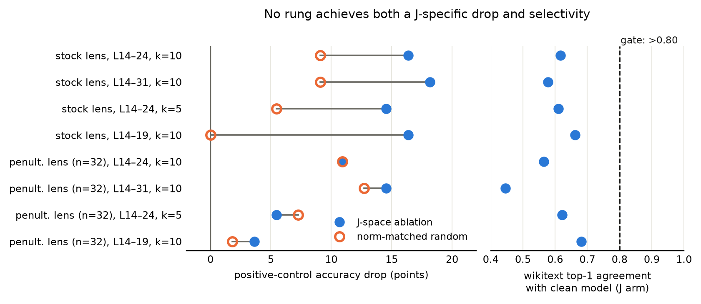

# Does Chain-of-Thought Still Protect Against J-Space Ablation When Problems Get Hard?

**Peter Flo** (Harvard University) · [paper (pdf)](paper.pdf) · [blog post](https://pflo.org/jspace-4b.html) · abstract accepted at [NEMI 2026](https://nemiconf.github.io/summer26/)

A pre-registered replication and extension of the J-space ablation experiments from
[*Verbalizable Representations Form a Global Workspace in Language Models*](https://transformer-circuits.pub/2026/workspace/index.html)
(Gurnee et al., Anthropic, 2026) on `Qwen/Qwen3-4B`.

**Result in one line:** the J-lens directions are causally real at 4B scale, but the
workspace/automatic separation the paper's chain-of-thought result rests on does not
transfer, so the pre-registered stop-gate correctly refused to run the main experiment.
The workspace signature may be an emergent property of scale.



## Key findings

1. **Causally real.** In the lightest layer band, ablating the top-10 J-lens directions
   per position costs 16 points on a two-step reasoning control while *exactly
   norm-matched random ablation costs zero* (n=55 paired items, exact McNemar p=.012),
   with outputs remaining coherent.
2. **Not selective.** The same ablation changes 34 to 42 percent of ordinary next-token
   predictions on held-out text, roughly double the matched-random arm, where the source
   paper reports ordinary prediction left largely intact at frontier scale.
3. **A diagnostic null.** An undertrained refit lens (n=32 prompts) behaves identically
   to the random control under ablation, which corroborates that the reference lens's
   J-vs-random gap reflects real structure.

## Repository structure

| Path | Contents |
|---|---|
| `paper.pdf` | The write-up (also on [pflo.org](https://pflo.org/papers/jspace-4b.pdf)) |
| `docs/PREREGISTRATION.md` | Hypotheses, design, and analysis plan, frozen at tag `prereg-v1` **before** any experiment ran |
| `docs/DEVIATIONS.md` | Timestamped log of every departure from the pre-registration |
| `docs/LEARNINGS.md` | Extended design rationale and lessons |
| `src/jspace/` | Ablation hooks, resumable generation, datasets, grading, calibration, lens fitting, grid runner, analysis |
| `tests/` | 7 unit tests certifying the intervention |
| `results/` | The evidence: both 8-rung calibration ladders with per-item outcomes, lens-validation artifacts, figures |
| `scripts/` | Crash-tolerant supervisors for unattended runs |

The main grid (`results/grid.jsonl`) intentionally does not exist: the pre-registered
stop-gate failed at all eight settings across two lenses, so per the pre-registration
the grid was not run. That refusal is the result.

## Setup

```bash
uv venv .venv --python 3.12
git clone https://github.com/anthropics/jacobian-lens vendor/jacobian-lens
uv pip install --python .venv/bin/python -e . -e vendor/jacobian-lens
```

The model (~8 GB) and the pre-fitted lens (~437 MB, from
[`neuronpedia/jacobian-lens`](https://huggingface.co/neuronpedia/jacobian-lens))
download from HF Hub on first run. Experiments ran on a single Apple M4 Pro (48 GB, MPS);
everything is device-agnostic.

## Reproducing the results

Each stage gates the next and every step is resumable (stage- or chunk-level checkpoints):

```bash
.venv/bin/python -m pytest tests/              # intervention-correctness tests
.venv/bin/python -u -m jspace.validate_lens    # gate 1 -> results/lens_validation.json
.venv/bin/python -u -m jspace.calibrate        # gate 2: hypothesis-blind ladder + stop-gate
                                               #   -> results/calibration.json (verdict: FAIL)
.venv/bin/python -u -m jspace.fit_lens         # contingency: penultimate-target lens, ~5.7h
export JSPACE_LENS_PATH=results/lens_fit/qwen3-4b_pen_n32.pt
.venv/bin/python -u -m jspace.validate_lens    # gate 1 for the refit
.venv/bin/python -u -m jspace.calibrate        # refit ladder -> calibration_pen.json (FAIL)
unset JSPACE_LENS_PATH
.venv/bin/python -m jspace.fig_ladder          # regenerates the figure from the two JSONs
```

`jspace.run_grid` and `jspace.analyze` implement the pre-registered main experiment; they
refuse to run while the stop-gate verdict is FAIL. The fitted penultimate lens (445 MB)
exceeds GitHub's file limit and is not committed; `jspace.fit_lens` regenerates it
(checkpointed per prompt).

## Citing

```bibtex
@misc{flo2026jspace,
  author = {Flo, Peter},
  title  = {Does Chain-of-Thought Still Protect Against J-Space Ablation When Problems Get Hard?},
  year   = {2026},
  note   = {Abstract accepted at the New England Mechanistic Interpretability Workshop (NEMI 2026)},
  url    = {https://github.com/pgrindehollevik-harvard/jspace-4b}
}
```

## License

MIT for the code in this repository. The companion
[jacobian-lens](https://github.com/anthropics/jacobian-lens) library (cloned at setup,
not vendored here) is Apache-2.0; models and datasets downloaded at run time are subject
to their own licenses.
